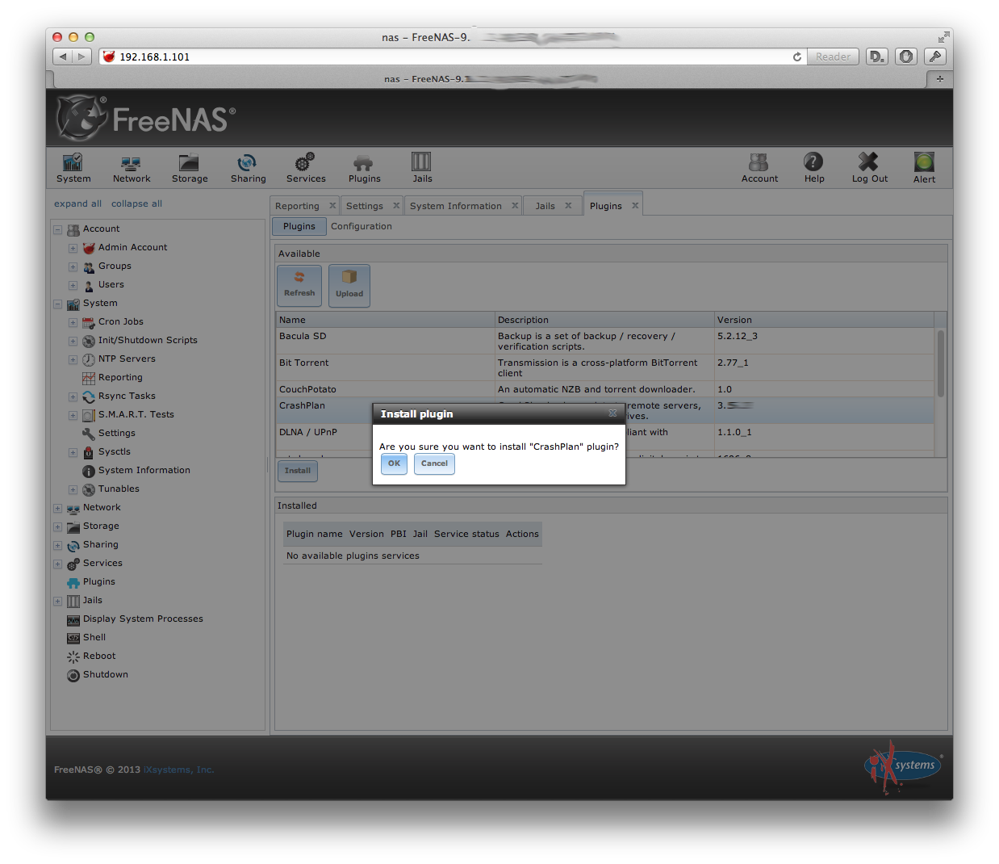
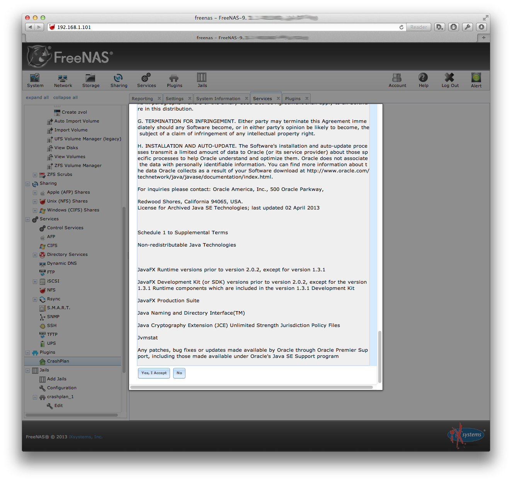
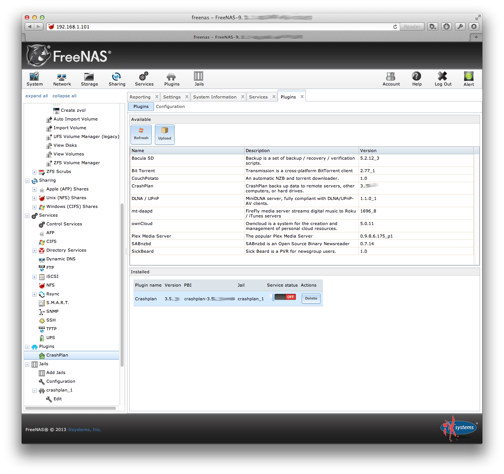
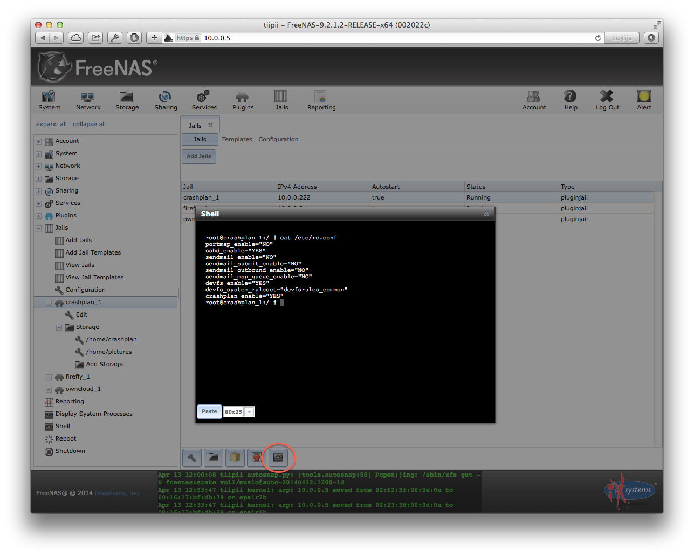

# How-to : Crashplan & Freenas

Pre-requisites

* [Crashplan account (free)](http://www.crashplan.com/)
* FreeNAS-9.2.1-RELEASE-x64

## Install

### Step 1: Install the Crashplan plugin version 3.5.3_1

Plugins --> Install Crashplan


### Step 2 : Accept TOS


### Step 3 : Enable Crashplan plugin


### Step 4 : Create a sshd user for the crashplan jail, enable TCP forwarding

Enable the sshd. The instructions below are taken from [the FreeNAS wiki](http://doc.freenas.org/index.php/Adding_Jails#Accessing_the_Command_Line_of_a_Jail)

Open terminal to _jail_


and edit /etc/rc.config
```
...
sshd_enable="YES"
...
```

Create User for ssh-access
```
[root@freenas] /mnt/zpool# jls
   JID  IP Address      Hostname                      Path
     1  -               crashplan_1                   /mnt/zpool/jails_2/crashplan_1
[root@freenas] /mnt/zpool# jexec 1 /bin/tcsh
```
Create a new user
```
root@crashplan_1:/ # adduser
Username: crashplan
.....
Login group is crashplan. Invite crashplan into other groups? []: wheel
....
Username   : crashplan
Password   : *****
Full Name  :
Uid        : 1001
Class      :
Groups     : crashplan wheel
Home       : /home/crashplan
Home Mode  :
Shell      : /bin/tcsh
Locked     : no
```

At this point, I like to copy my pub key to make things easier on me.

```
➜  ~  ssh-copy-id crashplan@192.168.1.103
```

Now, let's create a tunnel. This will redirect localhost 4200 to 4243 on the crashplan jail.

```
ssh -L 4200:127.0.0.1:4243 crashplan@192.168.1.103 -N -v -v
```


### Step 5 : Configure Crashplan UI to connect to remote host (through ssh-tunnel)

See [crashplan's documentation](http://support.crashplan.com/doku.php/how_to/configure_a_headless_client)

Set up a ssh tunnel by editing the ui properties file. ui.properties file location

```
Linux (if installed as root): /usr/local/crashplan/conf/ui.properties
Mac: /Applications/CrashPlan.app/Contents/Resources/Java/conf/ui.properties
Solaris (if installed as root): /opt/sfw/crashplan/conf/ui.properties
Windows: C:\Program Files\CrashPlan\conf\ui.properties
```

Change the service port to 4200, which we will use to tunnel to the remote connection.

```
servicePort=4200
```

### Step 6 : Verify Crashplan is running and listening

```
[root@freenas] ~# jexec crashplan_1 sockstat -4
USER     COMMAND    PID   FD PROTO  LOCAL ADDRESS         FOREIGN ADDRESS
crashplan sshd      4149  5  tcp4   192.168.1.103:22      192.168.1.83:53226
root     sshd       4147  5  tcp4   192.168.1.103:22      192.168.1.83:53226
root     java       3952  56 tcp4   127.0.0.1:4243        *:*
root     java       3952  57 tcp4   *:4242                *:*
root     java       3951  56 tcp4   127.0.0.1:4243        *:*
...
```
### Step 7: Connect with Crashplan UI

Launch the modified Crashplan UI (port 4200). Ssh-tunnel must be open. Login and configure. Quit UI and enjoy versioned backups to and from your FreeNAS.

## Update to 3.6.3

After update to 3.6.3 (happens automatically, pushed from Crashplan) the service fails to start. Thanks to mstinaff thread: http://forums.freenas.org/index.php?threads/crashplan-3-6-3.18416/ we now have a working solution to this.